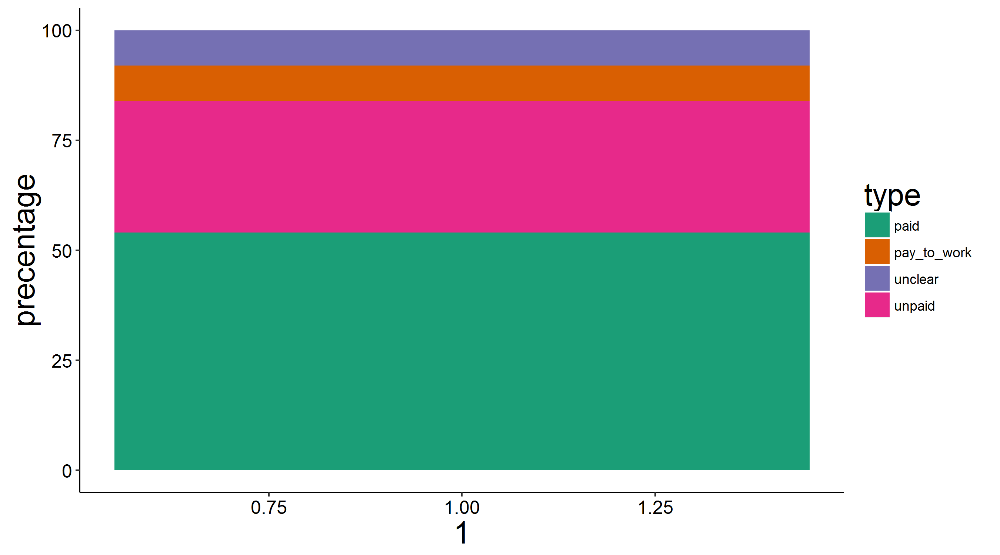
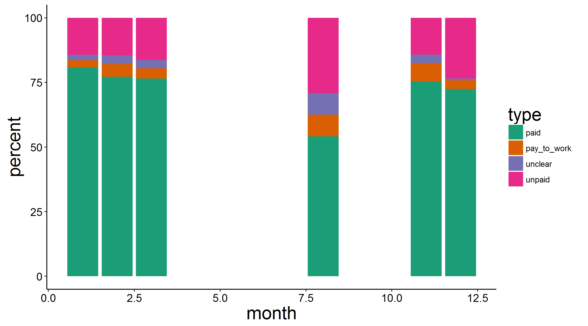
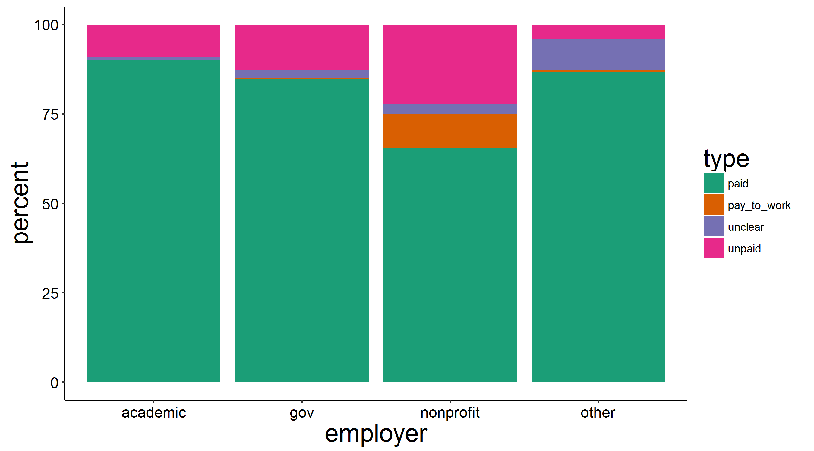
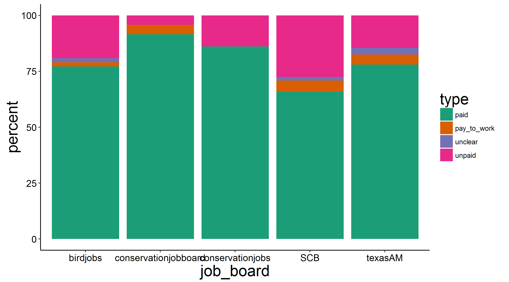

This is a basic visualization and summary of the data collected by Dr. Alex Bond and Auriel Fournier. 
Our end goal is to update this once monthly with summaries of technician positions from the following job boards to look at trends over time and help raise awareness about the frequency of these positions. 

Job boards:

[Texas A&M](http://wfscjobs.tamu.edu/job-board/) (last updated February 2015)  
[BirdJobs](https://www.osnabirds.org/Jobs.aspx) (last updated February 2016)  
[Conservation Job Board](http://www.conservationjobboard.com/) (last updated February 2016)  
[The Wildlife Society Job Board](http://careers.wildlife.org/home/index.cfm?site_id=8764) (last updated December 3, 2015)   
[Ecolog](https://listserv.umd.edu/archives/ecolog-l.html) (not yet included, but being collected now)  
[Evoldir](http://life.mcmaster.ca/cgi-bin/my_wrap/brian/evoldir/Jobs/) (not yet included, but being collected now)  
[Conservation Careers](http://www.conservation-careers.com/job/) (not yet included but being collected now)  
[Iowa State NREM](http://www.nrem.iastate.edu/employment/) (not yet included but being collected now)
[Society of Conservation Biology](http://careers.conbio.org/jobs/) (January 2015)

# If you would like to contribute data from another job board just let Alex or Auriel know. 

```{r, results='hide', echo=FALSE, warning=FALSE, message=FALSE}
# Install the `auriel` package
#library(devtools)
#install_github("aurielfournier/rel")
```

# original data from editorial

```{r, results='hide', echo=FALSE, warning=FALSE, message=FALSE}
library(ggplot2)
library(auriel)
library(reshape)
library(RColorBrewer)

jobs <- read.csv("./original_data.csv")

col4 <- brewer.pal(4,"Dark2")


a <- ggplot()+
  geom_bar(data=jobs, aes(x=1,y=precentage, fill=type), stat="identity")+
  scale_fill_manual(values=col4)+theme_krementz()

ggsave(a, file="./figure1_editorial_data.png", width=9)
```


 

# Continued Data Collection

Alex and I will continue collecting data from job boards to document the occurence of differnt kinds of seasonal technician jobs. 

We categorize them into four groups

paid = paid >= $300/month with housing (this in some areas will be close to minimum wage)
unpaid = paid <= $300/month with housing
pay to work = a position that is unpaid and the technician has to pay to 'work' for the project
unclear = it is not clear from the job positing if the job is paid or unpaid

This summary includes only season technician level positions. Not full time permanent jobs, or jobs requiring a graduate level degree. Though we have seen some of those being unpaid as well. 


```{r, results="hide", echo=FALSE, warning=FALSE, message=FALSE}

jobs <- read.csv("./ongoing_collection.csv")

mjobs <- melt(jobs[,c("month","count","type")], id=c("month","type"))

cjobs <- cast(mjobs, month + type ~ variable, sum, na.rm=TRUE)

months <- unique(cjobs$month)

cjobs$percent <- NA

for(i in seq(1,nrow(cjobs)-3,by=4)){
  #print(i)
  total <- sum(cjobs[i:(i+3),"count"])
  for(j in 0:3){
    cjobs[(i+j),"percent"] <- (cjobs[(i+j),"count"]/total)*100
  }
}

a <- ggplot()+
  geom_bar(data=cjobs, aes(x=month, y=percent, fill=type), stat="identity")+
  scale_fill_manual(values=col4)+
  theme_krementz()

ggsave(a, file="./figure2_new_by_month.png", width=9)

```


 

starting in November 2015 we began to break down our summary by employer as well. 

```{r, echo=FALSE, warning=FALSE, message=FALSE}

jobs <- read.csv("./ongoing_collection.csv")

jobs <- jobs[!is.na(jobs$employer),]  # removing the entries from August 2015 which were not broken down by employer

mjobs <- melt(jobs[,c("employer","count","type")], id=c("employer","type"))

cjobs <- cast(mjobs, employer + type ~ variable, sum, na.rm=TRUE)

cjobs$percent <- NA

for(i in seq(1,nrow(cjobs)-3,by=4)){
  #print(i)
  total <- sum(cjobs[i:(i+3),"count"])
  for(j in 0:3){
    cjobs[(i+j),"percent"] <- (cjobs[(i+j),"count"]/total)*100
  }
}

a <- ggplot()+
  geom_bar(data=cjobs, aes(x=employer, y=percent, fill=type), stat="identity")+
  scale_fill_manual(values=col4)+
  theme_krementz()

ggsave(a, file="./figure3_new_data_by_employer.png", width=9)

```


 

As of November 2015 we are now keeping track of which job board these data come from as well. 

```{r, echo=FALSE, warning=FALSE, message=FALSE}

jobs <- read.csv("./ongoing_collection.csv")

jobs <- jobs[!is.na(jobs$job_board),]  # removing the entries from August 2015 which were not broken down by employer

mjobs <- melt(jobs[,c("job_board","count","type")], id=c("job_board","type"))

cjobs <- cast(mjobs, job_board + type ~ variable, sum, na.rm=TRUE)

cjobs$percent <- NA

for(i in seq(1,nrow(cjobs)-3,by=4)){
  #print(i)
  total <- sum(cjobs[i:(i+3),"count"])
  for(j in 0:3){
    cjobs[(i+j),"percent"] <- (cjobs[(i+j),"count"]/total)*100
  }
}

a <- ggplot()+
  geom_bar(data=cjobs, aes(x=job_board, y=percent, fill=type), stat="identity")+
  scale_fill_manual(values=col4)+
  theme_krementz()

ggsave(a, file="./figure4_new_data_by_jobboard.png", width=9)
```


 
